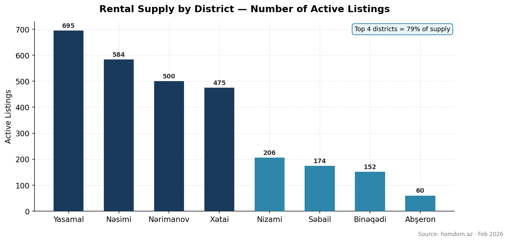
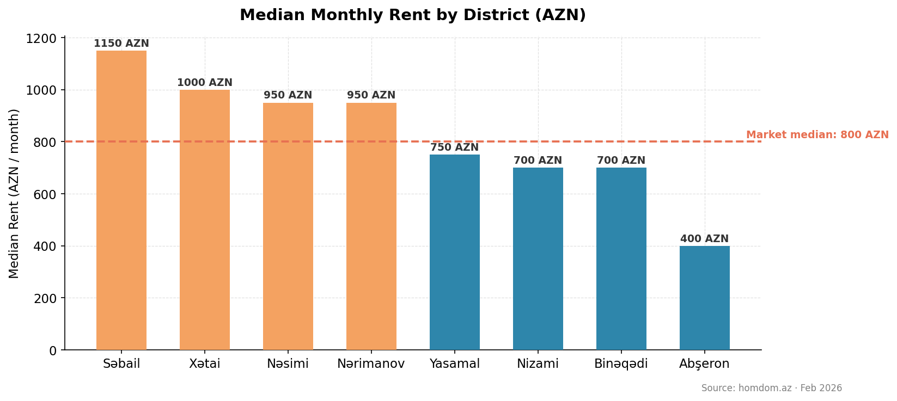
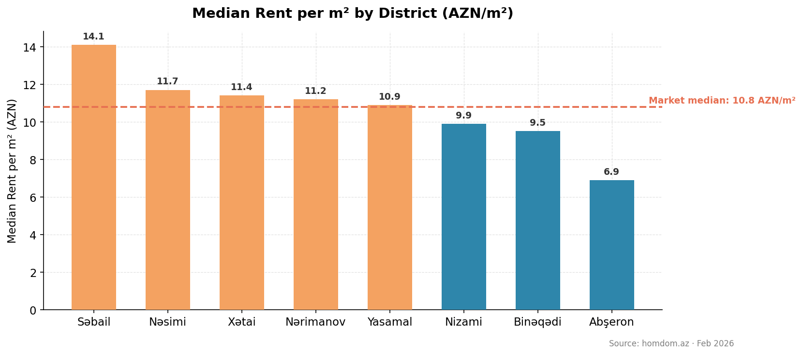
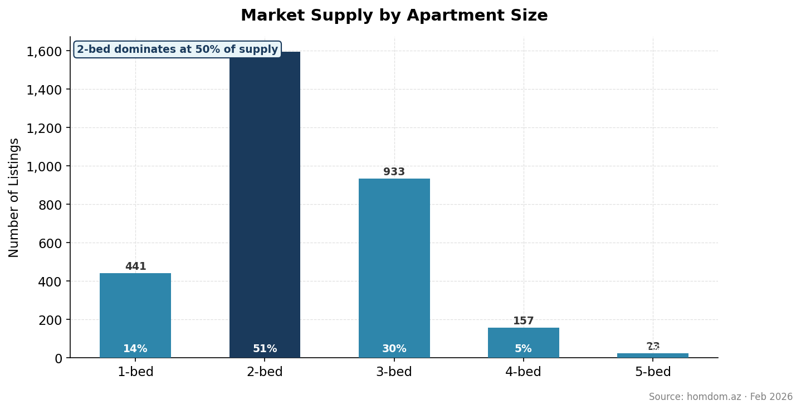
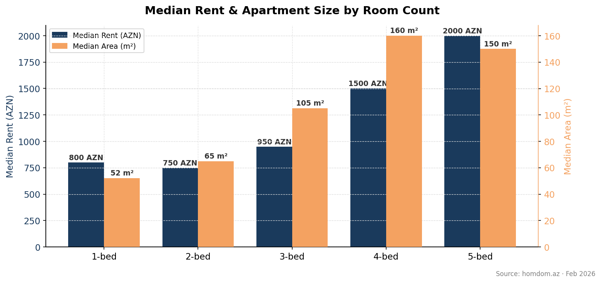
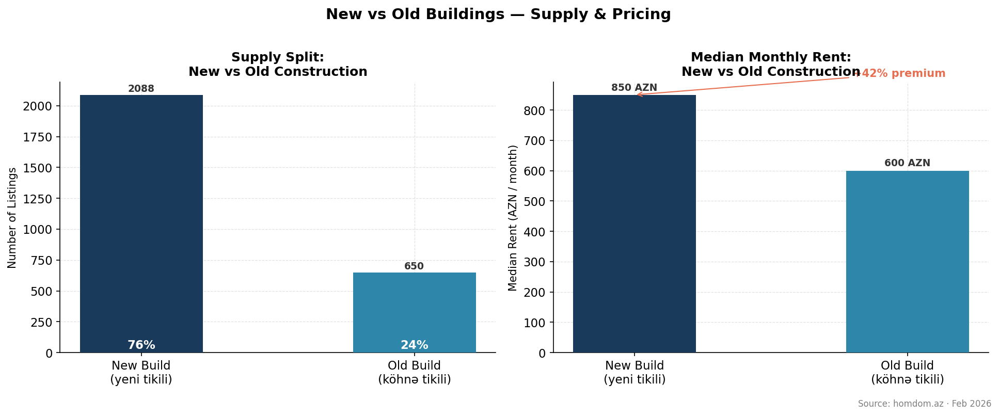
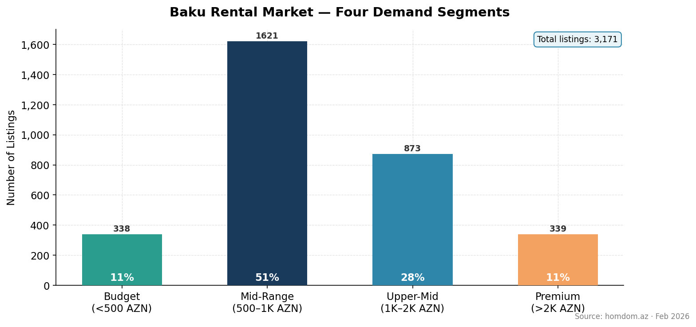
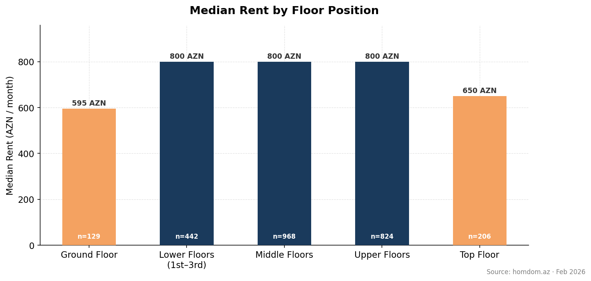
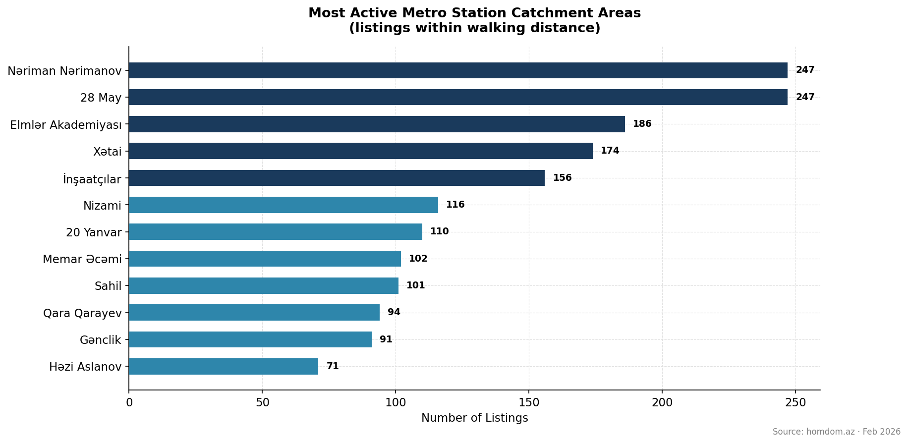
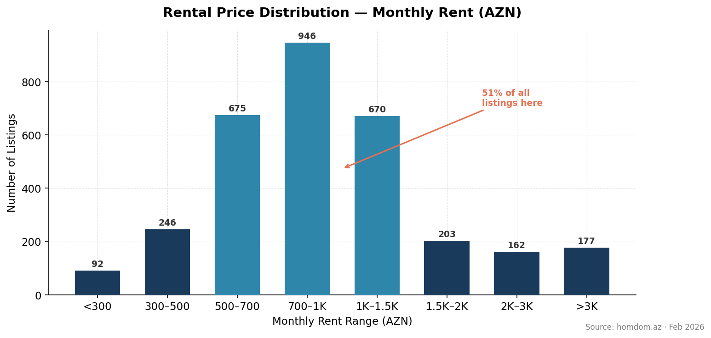

# Baku Rental Market Analysis — February 2026

---

## Executive Summary

Baku's rental market is active, mid-market dominated, and structurally fragmented. Across 3,171 active listings on homdom.az — the city's leading property portal — the median monthly rent stands at 800 AZN, with four central districts capturing 71% of all available supply. Two-bedroom apartments are the clear market standard, new construction commands a 42% premium over older stock, and no single agent or agency controls more than a fraction of total listings. For investors and operators, the fragmentation and geographic concentration present immediate, actionable opportunities.

---

## Finding 1 — Four Districts Own the Market

Yasamal (695 listings), Nəsimi (584), Nərimanov (500), and Xətai (475) together account for 71% of all rental supply in Baku. The remaining districts — Nizami, Səbail, Binəqədi, and Abşeron — collectively contribute less than 20% of listings.

**Why it matters:** Supply concentration in four districts means demand signals, vacancy trends, and price movements in these areas define the citywide narrative. Any investment thesis for Baku residential rental must begin with these four districts. Operators deploying capital elsewhere should price in the liquidity discount.

---

## Finding 2 — Səbail Commands a Premium. Yasamal Offers Value.

Median monthly rents range from 400 AZN in Abşeron to 1,174 AZN in Səbail — a spread of nearly 3x across the city. The premium tier clusters around Səbail (1,174 AZN), Xətai (1,000 AZN), and Nəsimi (999 AZN). Yasamal, despite being the highest-supply district, sits at a value-oriented 750 AZN median, and Nizami comes in at 700 AZN.

**Why it matters:** Yasamal's combination of high supply and below-average pricing signals a competitive, tenant-favorable market — making it attractive for renters but challenging for landlords seeking yield. Səbail and Xətai offer the strongest pricing power, appropriate for premium positioning strategies.

---

## Finding 3 — Səbail Delivers the Highest Space Value. Abşeron Is Half the Price per Square Meter.

On a per-square-meter basis, Səbail leads at 14.1 AZN/m², followed by Nəsimi (11.7 AZN/m²) and Xətai (11.4 AZN/m²). Abşeron sits at the bottom at 6.9 AZN/m² — 51% cheaper per square meter than Səbail.

**Why it matters:** Price-per-m² is the most direct measure of land and location value. The steep discount in Abşeron may reflect infrastructure gaps, distance from the city center, or early-stage development dynamics — all of which point to speculative upside if urban connectivity improves, but near-term yield risk for income-focused investors.

---

## Finding 4 — Two-Bedroom Apartments Are the Market Standard

Half of all active listings — exactly 50% — are two-bedroom units. Three-bedroom apartments represent the next largest segment at 29%, followed by one-bedroom units at 14%. Four- and five-bedroom listings together account for just 6% of supply.

**Why it matters:** The two-bedroom apartment is the de facto product-market fit for Baku renters. Developers and investors building or acquiring inventory should anchor their strategy around two-bedroom units to maximize absorption speed and minimize vacancy risk. One-bedroom units are significantly undersupplied relative to global urban rental norms, signaling a potential gap for compact, professionally managed units.

---

## Finding 5 — Two-Bedrooms Are Priced Below One-Bedrooms. Supply Is Suppressing Value.

Counterintuitively, two-bedroom apartments carry the lowest median rent of any configuration at 750 AZN — below the 950 AZN median for one-bedroom units. Three-bedroom units match one-bedrooms at 950 AZN, while four-bedroom and five-bedroom apartments command 1,500 AZN and 2,000 AZN respectively.

**Why it matters:** The two-bedroom pricing anomaly is a direct consequence of oversupply. When 50% of all listings compete in the same segment, pricing power collapses. Landlords with two-bedroom units should focus on differentiation — finishes, location, floor level — rather than competing on price alone. The premium segment (4BR+) remains undersupplied and better protected from price compression.

---

## Finding 6 — New Buildings Dominate Supply but Only Earn a Modest Premium

New construction accounts for 76% of all rental listings (2,088 units) at a median rent of 850 AZN. Older buildings represent 24% of supply (650 units) at a median of 600 AZN. The premium for new construction is 42% — meaningful in absolute terms, but modest given the extent of supply dominance.

**Why it matters:** When new buildings represent three-quarters of supply yet only command a 42% premium, it signals that volume is eroding the new-construction advantage. In a market where new buildings were genuinely scarce, that premium would be substantially higher. Developers and landlords in new stock should not rely on the "new building" label alone as a pricing lever — location, amenities, and management quality will increasingly differentiate.

---

## Finding 7 — The Rental Market Is Primarily Mid-Range

The 500–1,000 AZN band is the largest market segment, capturing 51% of all listings (1,621 units). Upper-mid-range properties (1,000–2,000 AZN) account for 28% (873 units). Budget listings below 500 AZN and premium listings above 2,000 AZN each represent 11% of the market (338 and 339 units respectively).

**Why it matters:** The mid-range segment's dominance means it attracts the most competitive pricing pressure and the highest renter volume. Operators targeting this band compete on volume; those targeting the upper-mid and premium tiers compete on quality and positioning. The near-equal size of budget and premium segments suggests a bifurcated demand base — Baku's rental market serves both ends of the income spectrum.

---

## Finding 8 — Ground and Top Floors Trade at a 25% Discount

Apartments on ground and top floors have a median rent of 600 AZN — 25% below the 800 AZN median for low, mid, and high floors. Mid-building units — regardless of whether they sit in the lower, middle, or upper third of a building — all price at the same 800 AZN median.

**Why it matters:** Floor position is a consistent and predictable pricing variable in Baku. Ground-floor units carry security and privacy concerns; top floors often lack elevators or carry maintenance perceptions. Buyers and operators acquiring ground or top-floor units can expect to offer a discount to achieve comparable occupancy — or invest in mitigating factors (security features, rooftop access, penthouse positioning) to close the gap.

---

## Finding 9 — Metro Proximity Concentrates Demand Around Key Nodes

The highest concentration of listings clusters around a handful of metro stations: Nəriman Nərimanov and 28 May lead with 247 listings each, followed by Elmlər Akademiyası (186), Xətai (174), and İnşaatçılar (156). Nine stations together account for the majority of metro-proximate supply.

**Why it matters:** Metro adjacency is a revealed preference signal — renters in Baku actively seek transit access, and the market concentrates supply accordingly. Properties within walking distance of these nine nodes carry structural demand advantages. For new acquisitions, proximity to an underrepresented but high-traffic station may offer the best risk-adjusted positioning.

---

## Finding 10 — No One Owns This Market. Yet.

The top 10 agents in Baku collectively control just 10.8% of all listings — 343 out of 3,171. The single largest category of listing owner is "Elan sahibi" (direct property owner), meaning the market is overwhelmingly owner-operated with minimal institutional intermediation.

**Why it matters:** This is the most strategically significant finding in the dataset. A fragmented, owner-operated market is a consolidation opportunity. A professional property management platform or rental aggregator that captures even 5% market share would immediately become a top-tier player. The absence of dominant agents means early movers face no entrenched competition — only the friction of educating a traditionally informal market.

---

## Strategic Recommendations

**Target the four core districts first.** Yasamal, Nəsimi, Nərimanov, and Xətai represent 71% of supply and the deepest pool of tenants and transactions. Any market entry or expansion strategy should be anchored here before extending to peripheral areas.

**Invest in one-bedroom units as a differentiated play.** With only 14% of supply in the one-bedroom segment and global urban demand trending toward compact, affordable units, this configuration is structurally undersupplied. Professionally managed one-bedroom apartments in central districts could command outsized yields relative to the crowded two-bedroom market.

**Position premium assets in Səbail and Xətai.** These districts sustain the highest absolute rents and the strongest price-per-m² metrics. Premium and upper-mid-range product belongs here — where pricing power is real and the tenant base can support it.

**Avoid competing on price in the two-bedroom segment.** With 1,595 two-bedroom units in active competition, price is a losing lever. Differentiation through building quality, furnishing standards, management responsiveness, and digital-first leasing processes will separate performance from the median.

**Build the platform, not just the portfolio.** With the top 10 agents controlling barely 10% of the market, the infrastructure of professional property management simply does not exist at scale in Baku. The highest-return opportunity may not be owning properties — it may be aggregating and managing them. A tech-enabled property management or rental platform targeting owner-operated listings is entering a market with no dominant incumbent and 3,000+ addressable units.

---

*Data source: homdom.az — Baku's leading residential property portal. Analysis based on 3,171 active rental listings as of February 27, 2026. All prices in Azerbaijani Manat (AZN).*
